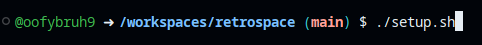
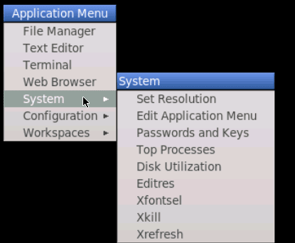
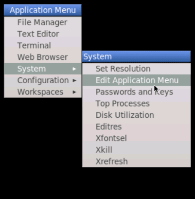
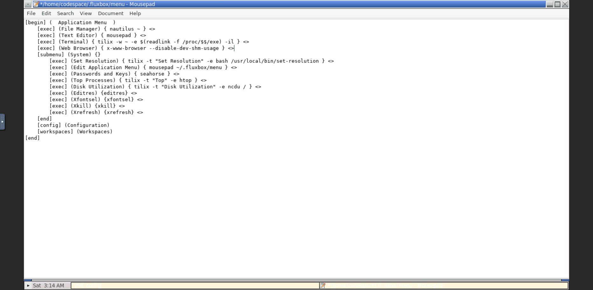

# retrospace

Emulation on a GitHub Codespace!

## Why?

Most people want to play classic games from their era or just wanna play Mario. But noone wants to go on a deep rabbithole to just find an good pc, emulator, and rom for their game to run smoothly, so I made this!

## Setup

### First steps

Fork the repo so u pay for the codespace cuz i cant afford all that usage, then click Code, then the tab Codespaces, then the plus button to create your codespace!

### Codespace time!

Just run `./setup.sh` in the terminal:  
  
Then close the tab and go to [GitHub Codespaces](https://github.com/codespaces) and click on the three dots and then click 'Stop Codespace'.  
Then wait till the page reloads and then reenter the codespace to let the changes take effect.  
Then run on the terminal `./emu.sh`  
  

### Entering the Desktop

Go to the Ports tab  and select the URL next to `desktop (6080)`   Click that URL and then click the globe  to access the desktop.  
  
Right click the desktop and go to the System tab  
  
Then click Edit Desktop Menu  
  
You will get to a screen similar to this  
  
Delete the Web Browser line  
and add these lines to the bottom of the Web Browser tab  

```text
    [exec] (Your Browser name) { browser-exe } <>
    [exec] (ES-DE) { ~/apps/ES-DE_x64.AppImage } <>
    [exec] (RetroArch) { flatpak run org.libretro.RetroArch }
    [exec] (Wine GUI) { winegui } <>
    [exec] (Bauh (App Store)) { bauh } <>
```

> [!IMPORTANT]
> Replace `Your Browser name` with your browser choice when running `emu.sh` and `browser-exe` with your browser's executable shown below:  
>
> Chrome: `google-chrome`  
> Firefox: `flatpak run org.mozilla.firefox`  
> Chromium: `flatpak run org.chromium.Chromium`  
> Opera: `opera`  
> Vivaldi: `vivaldi`  

### End! `¯\_(ツ)_/¯`

And there you go! You now have a retro gaming machine, accessible ANYWHERE(if u login with github :D )
